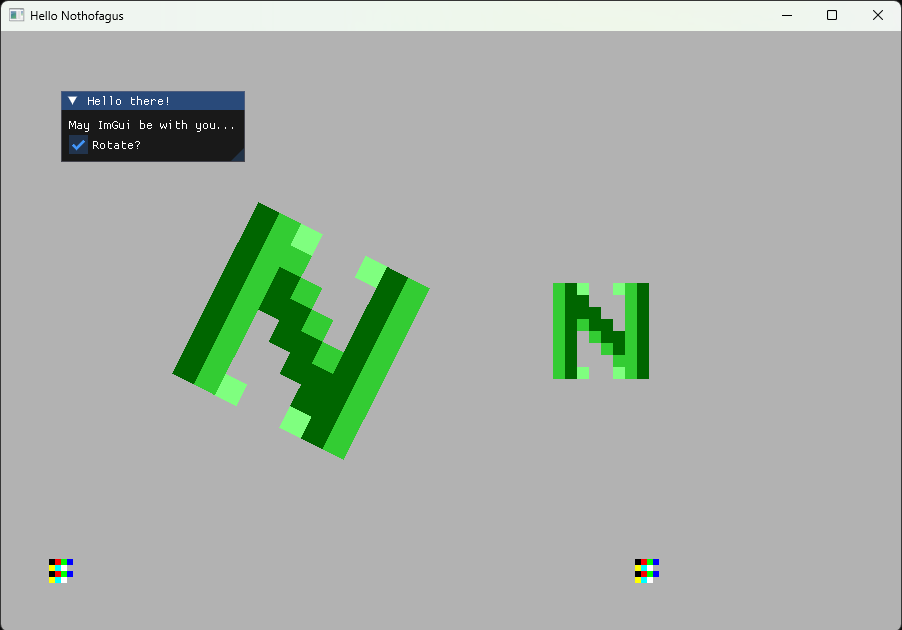

# Nothofagus Renderer


Sandbox C++ pixel art real time renderer using OpenGL 3.3 under the hood.
You define some textures in your code, some dynamic locations and you are ready to quick start your game/application.
Nothofagus also gives you access to ImGui and other third party libs to speed up your development journey.

Your code will look like this.

```
Nothofagus::ColorPallete pallete{
    {0.0, 0.0, 0.0, 0.0},
    {0.0, 0.4, 0.0, 1.0},
    {0.2, 0.8, 0.2, 1.0},
    {0.5, 1.0, 0.5, 1.0},
};

Nothofagus::IndirectTexture texture({8, 8}, {0.5, 0.5, 0.5, 1.0});
texture.setPallete(pallete)
    .setPixels(
    {
        2,1,3,0,0,3,2,1,
        2,1,1,0,0,0,2,1,
        2,1,1,1,0,0,2,1,
        2,1,2,1,1,0,2,1,
        2,1,0,2,1,1,2,1,
        2,1,0,0,2,1,2,1,
        2,1,0,0,0,2,2,1,
        2,1,3,0,0,3,2,1,
    }
);
Nothofagus::TextureId textureId = canvas.addTexture(texture);
Nothofagus::BellotaId bellotaId = canvas.addBellota({{{75.0f, 75.0f}}, textureId});

canvas.run(update);
```

A `Bellota` is a drawable element. Each number in the texture corresponds to the index of the color specified in the `TexturePallete`. Yes, it is an indirect color scheme.

You can make animations by providing an `update` function.

```
float time = 0.0f;
bool rotate = true;

auto update = [&](float dt)
{
    time += dt;

    ImGui::Begin("Hello there!");
    ImGui::Text("May ImGui be with you...");
    ImGui::Checkbox("Rotate?", &rotate);
    if (rotate)
    {
        Nothofagus::Bellota& bellota = canvas.bellota(bellotaId);
        bellota.transform().angle() = 0.1f * time;
    }
    ImGui::End();
};

canvas.run(update);
```

And if you want to make it interactive, just add a `Controller`

```
Nothofagus::Controller controller;
controller.registerAction({Nothofagus::Key::W, Nothofagus::DiscreteTrigger::Press}, [&]()
{
    canvas.bellota(bellotaId).transform().location().y += 10.0f;
});

canvas.run(update, controller);
```

This is a screenshot of [examples/hello_nothofagus.cpp](examples/hello_nothofagus.cpp)


## Setting up your project

You can use this repository as a git submodule

```
git submodule add https://github.com/dantros/nothofagus.git third_party/nothofagus
```

And then use `add_subdirectory` from your project's CMake file.

```
option(NOTHOFAGUS_INSTALL "Disabling installation of Nothofagus" OFF)
add_subdirectory("third_party/nothofagus")

add_executable(nothofagus_demo
    "source/nothofagus_demo.cpp"
)
set_property(TARGET nothofagus_demo PROPERTY CXX_STANDARD 20)
target_include_directories(nothofagus_demo PRIVATE ${NOTHOFAGUS_INCLUDE})
target_link_libraries(nothofagus_demo PRIVATE nothofagus)
```

You can check the friend repo [nothofagus_demo](https://github.com/dantros/nothofagus_demo) with a full example.

Of course there are other ways to work, choose whatever suits you best.

## Quick start

```
git clone --recursive https://github.com/dantros/nothofagus.git
cd nothofagus
cmake --preset ninja-release
cd ../build_cmake/ninja-release/
ninja
ninja install
cd ../install_cmake/ninja-release/
```

If you forgot the `--recursive` argument, you can always download the dependencies later with

```
git submodule --init --recursive
```

There you will find the nothofagus static library and some demos.

## Dependencies

You should have [cmake](https://cmake.org/), [ninja](https://ninja-build.org/) and [Visual Studio Community](https://visualstudio.microsoft.com/vs/community/) (or another proper compiler) in your development environment.

## Special Features

- [Sprite Animations](docs/sprite_animations.md)

## Doxygen Documentation [WIP]

This project uses Doxygen to create documentation, so you need to have Doxygen installed (https://www.doxygen.nl/manual/install.html). This documentation is not build by default. You need to enable it via CMake by setting the variable `NOTHOFAGUS_BUILD_DOCS` to `ON` either via cli cmake, cmake-gui or via your user cmake presets.

Then, from the repository directory you should run the next command:

```bash
    doxygen Doxyfile
```

You can also use ninja to generate documentation at installation.

```bash
    cmake --preset ninja-release-examples
    cd ../build/ninja-release-examples
    ninja install
    ninja doc_doxygen
```
