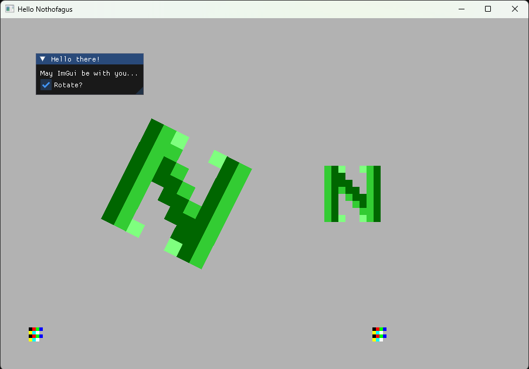

# Nothofagus

Sandbox C++ pixel art real time renderer using OpenGL 3.3 under the hood.
You define some textures in your code, some dynamic locations and you are ready to quick start your game.
Nothofagus also gives you access to ImGui and other third party libs to speed up your development journey.

```
Nothofagus::ColorPallete pallete{
    {0.0, 0.0, 0.0, 0.0},
    {0.0, 0.4, 0.0, 1.0},
    {0.2, 0.8, 0.2, 1.0},
    {0.5, 1.0, 0.5, 1.0},
};

Nothofagus::Texture texture({8, 8}, {0.5, 0.5, 0.5, 1.0});
texture.setPallete(pallete)
    .setPixels(
    {
        2,1,3,0,0,3,2,1,
        2,1,1,0,0,0,2,1,
        2,1,1,1,0,0,2,1,
        2,1,2,1,1,0,2,1,
        2,1,0,2,1,1,2,1,
        2,1,0,0,2,1,2,1,
        2,1,0,0,0,2,2,1,
        2,1,3,0,0,3,2,1,
    }
);
Nothofagus::TextureId textureId = canvas.addTexture(texture);
Nothofagus::BellotaId bellotaId = canvas.addBellota({{{75.0f, 75.0f}}, textureId});

canvas.run(update);
```
You can make animations by providing an `update` function.
```
float time = 0.0f;
bool rotate = true;

auto update = [&](float dt)
{
    time += dt;

    ImGui::Begin("Hello there!");
    ImGui::Text("May ImGui be with you...");
    ImGui::Checkbox("Rotate?", &rotate);
    if (rotate)
    {
        Nothofagus::Bellota& bellota = canvas.bellota(bellotaId);
        bellota.transform().angle() = 0.1f * time;
    }
    ImGui::End();
};

canvas.run(update);
```
And if you want to make it interactive, just add a `Controller`
```
Nothofagus::Controller controller;
controller.registerAction({Nothofagus::Key::W, Nothofagus::DiscreteTrigger::Press}, [&]()
{
    canvas.bellota(bellotaId).transform().location().y += 10.0f;
});

canvas.run(update, controller);
```
This is a screenshot of [examples/hello_nothofagus.cpp](examples/hello_nothofagus.cpp)


## Quick start

```
git clone https://github.com/dantros/nothofagus.git
cd nothofagus
git submodule update --init --recursive
cmake --presets ninja-release
cd ../build_cmake/ninja-release/
ninja
ninja install
cd ../install_cmake/ninja-release/
```
There you will fing the nothofagus static library and some demos.

## Dependencies

You should have [cmake](https://cmake.org/), [ninja](https://ninja-build.org/) and [Visual Studio Community](https://visualstudio.microsoft.com/vs/community/) (or another proper compiler) in your development environment.
