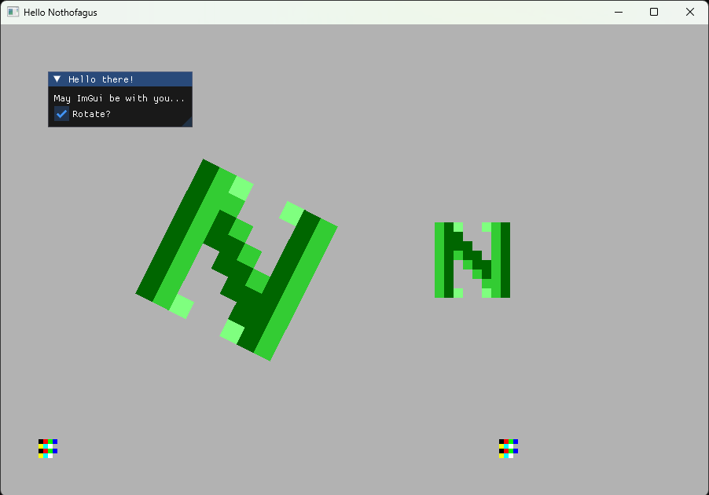

# Nothofagus Renderer


A C++20 pixel-art real-time renderer. Pick **OpenGL 3.3** or **Vulkan** as the
graphics backend, **GLFW** or **SDL3** for windowing and input, or compile
**headless Vulkan** for offscreen / CI rendering with no display server. ImGui
is bundled and works on every combination — including diegetic UI rendered
into an off-screen texture inside the game world.

Define some textures and dynamic transforms, give it an update callback, and
you have a running game/application.

```cpp
Nothofagus::ColorPallete pallete{
    {0.0, 0.0, 0.0, 0.0},
    {0.0, 0.4, 0.0, 1.0},
    {0.2, 0.8, 0.2, 1.0},
    {0.5, 1.0, 0.5, 1.0},
};

Nothofagus::IndirectTexture texture({8, 8}, {0.5, 0.5, 0.5, 1.0});
texture.setPallete(pallete)
    .setPixels(
    {
        2,1,3,0,0,3,2,1,
        2,1,1,0,0,0,2,1,
        2,1,1,1,0,0,2,1,
        2,1,2,1,1,0,2,1,
        2,1,0,2,1,1,2,1,
        2,1,0,0,2,1,2,1,
        2,1,0,0,0,2,2,1,
        2,1,3,0,0,3,2,1,
    }
);
Nothofagus::TextureId textureId = canvas.addTexture(texture);
Nothofagus::BellotaId bellotaId = canvas.addBellota({{{75.0f, 75.0f}}, textureId});

canvas.run(update);
```

A `Bellota` is a drawable element. Each number in the texture is an index into
the `ColorPallete` — yes, it is an indirect color scheme.

Animate by providing an `update` callback:

```cpp
float time = 0.0f;
bool rotate = true;

auto update = [&](float dt)
{
    time += dt;

    ImGui::Begin("Hello there!");
    ImGui::Text("May ImGui be with you...");
    ImGui::Checkbox("Rotate?", &rotate);
    if (rotate)
    {
        Nothofagus::Bellota& bellota = canvas.bellota(bellotaId);
        bellota.transform().angle() = 0.1f * time;
    }
    ImGui::End();
};

canvas.run(update);
```

Make it interactive with a `Controller`:

```cpp
Nothofagus::Controller controller;
controller.registerAction({Nothofagus::Key::W, Nothofagus::DiscreteTrigger::Press}, [&]()
{
    canvas.bellota(bellotaId).transform().location().y += 10.0f;
});

canvas.run(update, controller);
```

This is a screenshot of [examples/hello_nothofagus.cpp](examples/hello_nothofagus.cpp)



## Setting up your project

Use this repository as a git submodule:

```
git submodule add https://github.com/dantros/nothofagus.git third_party/nothofagus
```

Then `add_subdirectory` from your project's CMake file. Flip the backend
options to match your target:

```cmake
option(NOTHOFAGUS_INSTALL "Disabling installation of Nothofagus" OFF)

# Optional — defaults are GLFW + OpenGL 3.3.
set(NOTHOFAGUS_WINDOW_BACKEND "GLFW" CACHE STRING "")   # or "SDL3"
set(NOTHOFAGUS_BACKEND_VULKAN  OFF   CACHE BOOL   "")   # ON for Vulkan
set(NOTHOFAGUS_HEADLESS_VULKAN OFF   CACHE BOOL   "")   # ON for offscreen-only

add_subdirectory("third_party/nothofagus")

add_executable(nothofagus_demo
    "source/nothofagus_demo.cpp"
)
set_property(TARGET nothofagus_demo PROPERTY CXX_STANDARD 20)
target_include_directories(nothofagus_demo PRIVATE ${NOTHOFAGUS_INCLUDE})
target_link_libraries(nothofagus_demo PRIVATE nothofagus)
```

See the companion repo [nothofagus_demo](https://github.com/dantros/nothofagus_demo)
for a complete consumer project.

## Quick start

```
git clone --recursive https://github.com/dantros/nothofagus.git
cd nothofagus
cmake --preset linux-release-glfw-opengl-examples
cmake --build build/linux-release-glfw-opengl-examples --parallel
cmake --install build/linux-release-glfw-opengl-examples
```

Replace the preset with whatever combination you need — see the
[build matrix](#build-matrix) below. On Windows, swap the prefix for
`windows-` and you're done.

If you forgot `--recursive`, fetch the submodules now:

```
git submodule update --init --recursive
```

The static library and example binaries land in
`install/<preset-name>/`.

## Feature tour

### Direct textures (raw RGBA)

For non-paletted sprites — photographs, screenshots, decoded image files —
use `DirectTexture` and pass raw RGBA bytes:

```cpp
Nothofagus::DirectTexture tex({width, height});
tex.setPixels(/* width * height * 4 bytes of RGBA */);
Nothofagus::TextureId texId = canvas.addTexture(tex);
canvas.addBellota({{{x, y}}, texId});
```

→ [examples/hello_direct_texture.cpp](examples/hello_direct_texture.cpp)

### Input: keyboard, mouse, gamepad

The same `Controller` handles all three input devices. Mouse positions are
delivered in game canvas coordinates (origin bottom-left), and gamepads are
polled per frame with deadzone + axis normalisation applied for you.

```cpp
Nothofagus::Controller controller;

controller.registerAction({Key::W, DiscreteTrigger::Press}, [&]{ /* ... */ });
controller.registerMouseAction({MouseButton::Left, DiscreteTrigger::Press}, [&]{ /* ... */ });
controller.registerMouseMove([&](glm::vec2 pos){ /* ... */ });
controller.registerGamepadAction({0, GamepadButton::A, DiscreteTrigger::Press}, [&]{ /* ... */ });
controller.registerGamepadAxis(0, GamepadAxis::LeftX, [&](float v){ /* ... */ });

canvas.run(update, controller);
```

→ [examples/test_keyboard.cpp](examples/test_keyboard.cpp),
[examples/test_gamepad.cpp](examples/test_gamepad.cpp)

### Animations + state machine

Multi-layer `IndirectTexture` stores frames as layers.
`AnimationStateMachine` drives `bellota.currentLayer()` automatically:

```cpp
AnimationState idle({0, 1, 2}, {100.0f, 100.0f, 100.0f}, "idle");
AnimationState run ({3, 4},    { 80.0f,  80.0f},          "run");

AnimationStateMachine machine(canvas.bellota(id));
machine.addState("idle", &idle).addState("run", &run);
machine.newAnimationTransition("idle", "start_running", "run");
machine.setState("idle");

// per frame:
machine.update(dt);
machine.transition("start_running");
```

→ [markdown_docs/sprite_animations.md](markdown_docs/sprite_animations.md),
[examples/hello_animation.cpp](examples/hello_animation.cpp),
[examples/hello_animation_state_machine.cpp](examples/hello_animation_state_machine.cpp)

### Tilemaps

For tile-based worlds, `IndirectTexture::setMap` opts a texture into tile-map
mode where each cell selects a layer to draw from a shared atlas. For huge or
sparse worlds, `Tilemap` / `Sparsemap` paired with an `Explorer` keep a pool
of small chunk textures sized to the viewport and rotate world chunks through
them as the camera scrolls — memory stays bounded regardless of world size.

```cpp
auto tilemapId  = canvas.addTilemap(Nothofagus::Tilemap(mapSize, chunkSize, tileSize, palette, tileGraphics));
auto explorerId = canvas.addTilemapExplorer(Nothofagus::TilemapExplorer(tilemapId));

canvas.tilemap(tilemapId).setCell({worldX, worldY}, layerIndex);
canvas.tilemapExplorer(explorerId).setCamera({scrollX, scrollY});
```

→ [examples/hello_tilemap.cpp](examples/hello_tilemap.cpp),
[examples/hello_tilemap_huge.cpp](examples/hello_tilemap_huge.cpp),
[examples/hello_sparsemap.cpp](examples/hello_sparsemap.cpp)

### Custom meshes

Bellotas draw a centered quad sized to their texture by default. Register a
custom triangle mesh and attach it to a bellota to draw arbitrary geometry,
still sampling the texture through the same shader:

```cpp
Nothofagus::Mesh mesh;
mesh.vertices = { /* position + uv */ };
mesh.indices  = { /* triangles    */ };

auto meshId = canvas.addMesh(mesh);
canvas.addBellota({{{x, y}}, texId, meshId});
```

→ [examples/hello_mesh.cpp](examples/hello_mesh.cpp)

### Render to texture

Render bellotas into an off-screen texture and sample it from another
bellota — the foundation for diegetic UI, mirrors, mini-maps, and
post-processing. Render targets can also feed each other.

```cpp
auto renderTargetId = canvas.addRenderTarget({64, 64});
auto displayId      = canvas.addBellota({{{x, y}}, canvas.renderTargetTexture(renderTargetId)});

canvas.run([&](float dt) {
    canvas.renderTo(renderTargetId, {sourceBellotaA, sourceBellotaB});
});
```

→ [examples/hello_render_to_texture.cpp](examples/hello_render_to_texture.cpp),
[examples/hello_nested_render_targets.cpp](examples/hello_nested_render_targets.cpp)

### Diegetic ImGui + custom fonts

Run ImGui calls into a render target with `renderImguiTo` to make an
interactive ImGui panel that lives inside the game world. Bake custom TTF
fonts at logical pixel sizes for crisp glyphs.

```cpp
auto fontId = canvas.bakeImguiFont(canvas.defaultImguiFontSourceId(), 12.0f);

canvas.renderImguiTo(renderTargetId, fontId, [&] {
    ImGui::Begin("in-world panel");
    ImGui::SliderFloat("value", &v, 0.0f, 1.0f);
    ImGui::End();
});
```

→ [examples/hello_imgui_rtt.cpp](examples/hello_imgui_rtt.cpp),
[examples/hello_custom_font.cpp](examples/hello_custom_font.cpp)

### Screenshots

`takeScreenshot()` returns the last rendered frame as a `DirectTexture` — you
can save it via your image library of choice, or load it straight back into
the canvas as a regular texture.

```cpp
Nothofagus::DirectTexture shot = canvas.takeScreenshot();
Nothofagus::TextureData data = shot.generateTextureData();   // raw RGBA, top-to-bottom
```

→ [examples/hello_screenshot.cpp](examples/hello_screenshot.cpp)

### Headless and manual ticking

Two ways to run without a visible window:

- **`headless=true`** at construction — the window still exists (GLFW/SDL) but
  is hidden. Requires a display server on Linux. Good for local automation.
- **`-DNOTHOFAGUS_HEADLESS_VULKAN=ON`** at build time — no window and no
  display server, pure offscreen Vulkan rendering. Designed for CI lanes
  using software Vulkan (SwiftShader / lavapipe).

Either way, drive the loop manually with `tick(dt)`:

```cpp
Nothofagus::Canvas canvas({15, 10}, "test", {0,0,0}, 1, 14, /*headless=*/true);
for (int i = 0; i < 10; ++i) canvas.tick(16.0f);
Nothofagus::DirectTexture shot = canvas.takeScreenshot();
```

→ [examples/hello_headless.cpp](examples/hello_headless.cpp)

## Build matrix

Presets follow the pattern `{platform}-{buildtype}-{window}-{graphics}[-examples]`.
Add `-examples` to also build the demo binaries.

| Platform | Window backend | Graphics backend |
|----------|----------------|------------------|
| `windows`, `linux` | `glfw` | `opengl` or `vulkan` |
| `windows`, `linux` | `sdl3` | `opengl` or `vulkan` |
| `windows`, `linux` | `headless` | `vulkan` (offscreen, no display server) |

`{buildtype}` is `debug` or `release`. See [CMakePresets.json](CMakePresets.json)
for the full preset list and [CLAUDE.md](CLAUDE.md) for per-option details
(`NOTHOFAGUS_WINDOW_BACKEND`, `NOTHOFAGUS_BACKEND_VULKAN`,
`NOTHOFAGUS_HEADLESS_VULKAN`, `NOTHOFAGUS_BUILD_EXAMPLES`, ...).

## Examples

| File | Demonstrates |
|------|--------------|
| [hello_nothofagus.cpp](examples/hello_nothofagus.cpp) | Basic setup — `IndirectTexture` + ImGui + rotation |
| [hello_direct_texture.cpp](examples/hello_direct_texture.cpp) | `DirectTexture` (raw RGBA) |
| [hello_animation.cpp](examples/hello_animation.cpp) | Single-state frame animation |
| [hello_animation_state_machine.cpp](examples/hello_animation_state_machine.cpp) | Full state machine with WASD-driven transitions |
| [hello_layers.cpp](examples/hello_layers.cpp) | Depth-based layering |
| [hello_tint.cpp](examples/hello_tint.cpp) | Per-bellota color tinting |
| [hello_text.cpp](examples/hello_text.cpp) | Text rendering with the bundled bitmap font |
| [hello_markdown.cpp](examples/hello_markdown.cpp) | Markdown rendering via `imgui_md` |
| [hello_mesh.cpp](examples/hello_mesh.cpp) | Custom triangle meshes |
| [hello_tilemap.cpp](examples/hello_tilemap.cpp) | Tile-map mode of `IndirectTexture` |
| [hello_tilemap_huge.cpp](examples/hello_tilemap_huge.cpp) | Huge tilemaps via `Tilemap` + `TilemapExplorer` pool |
| [hello_sparsemap.cpp](examples/hello_sparsemap.cpp) | Sparse / unbounded tilemaps with simulated streaming |
| [hello_render_to_texture.cpp](examples/hello_render_to_texture.cpp) | Off-screen render targets sampled by bellotas |
| [hello_nested_render_targets.cpp](examples/hello_nested_render_targets.cpp) | One RTT's output feeding another |
| [hello_imgui_rtt.cpp](examples/hello_imgui_rtt.cpp) | Diegetic ImGui — UI rendered inside the game world |
| [hello_custom_font.cpp](examples/hello_custom_font.cpp) | User-supplied TTF fonts via `addImguiFontSource` |
| [hello_screenshot.cpp](examples/hello_screenshot.cpp) | `takeScreenshot()` — capture frame as a texture |
| [hello_headless.cpp](examples/hello_headless.cpp) | Headless mode + manual `tick()` |
| [test_keyboard.cpp](examples/test_keyboard.cpp) | Keyboard input handling |
| [test_gamepad.cpp](examples/test_gamepad.cpp) | Gamepad sticks, D-pad, buttons, ImGui status |
| [test_create_destroy.cpp](examples/test_create_destroy.cpp) | Object lifecycle |

## Further reading

- [CLAUDE.md](CLAUDE.md) — full architecture and API patterns reference: backend
  abstractions, Vulkan presentation policy, public API patterns, lifecycle
  rules, and complete CMake option list.
- [markdown_docs/sprite_animations.md](markdown_docs/sprite_animations.md) —
  sprite animation deep dive.
- [CMakePresets.json](CMakePresets.json) — every supported build configuration.

### Doxygen docs (WIP)

Doxygen documentation is opt-in via the `NOTHOFAGUS_BUILD_DOCS=ON` CMake
option (requires [Doxygen](https://www.doxygen.nl/manual/install.html)
installed). Generate by hand from the repo root:

```bash
doxygen Doxyfile
```

Or build them as part of an install:

```bash
cmake --preset linux-release-glfw-opengl-examples -DNOTHOFAGUS_BUILD_DOCS=ON
cmake --build build/linux-release-glfw-opengl-examples --parallel
cmake --build build/linux-release-glfw-opengl-examples --target doc_doxygen
```

## Dependencies

You'll need [CMake](https://cmake.org/), [Ninja](https://ninja-build.org/),
and a C++20 compiler (clang-cl on Windows, clang++ on Linux are what the
presets use; [Visual Studio Community](https://visualstudio.microsoft.com/vs/community/)
works too). For the Vulkan backend, install the Vulkan SDK.

Bundled as git submodules under [third_party/](third_party/): GLFW, SDL3,
glad (OpenGL loader), glm (math), Dear ImGui, spdlog, font8x8 (bitmap font),
imgui_md + md4c (markdown rendering), imgui-filebrowser, vk-bootstrap,
VulkanMemoryAllocator, Catch2 (tests).

## License

[MIT](LICENSE) © Daniel Calderón
