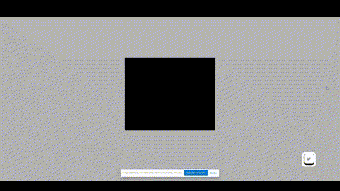
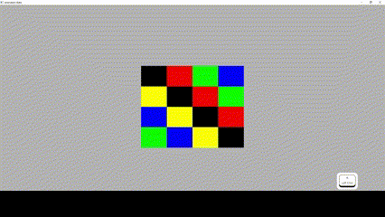

## Sprite Animations

Nothofagus was a single-sprite-per-object engine, thus for representing movement or interaction with the world depicted in the scene it meant using sound effects and/or a new object appearing. Visual motion was not something easily achivable for every case and needed to hardcode a lot of objects for every frame of the movement.

Motivated by this, a feature to improve was the ability to animate characters by accumulating frames in a texture array, and creating a way to manage transitions between different animations.

For this assignment, an animation method was implemented in a class called AnimatedBellota, which uses array textures (also known as texture atlases, see more at https://www.khronos.org/opengl/wiki/Array_Texture) to send information about the sprites that could be shown for the character. These sprites are distributed on the layers of the texture. This tool aligns with the actual code in Nothofagus for Bellotas and Textures.

A state machine was created for animation transitions. It's nodes are animation states, associated with the layers of an animation and the time intervals each has to be shown. It also has a transition map, which allows to move from one state to another along the edges of the departing node. It was made this way resembling the Godot animation tree and its a compact and intuitive way to do it.

### Animated Bellota

The AnimatedBellota class represents a graphical element in the system capable of dynamically switching between multiple layers (has a variable with that name) of a TextureArray. This allows it to display animations by cycling through the layers of a texture array, which is especially useful for representing animated characters or objects with dynamic states.

#### Why is AnimatedBellota different from Bellota?

While Bellota is designed to represent static elements that use a single texture (TextureId), AnimatedBellota extends this functionality to support multiple layers of textures via a TextureArray. The key differences are:

- Support for TextureArray: AnimatedBellota uses a TextureId instead of a TextureId, enabling it to access textures arrays in the canvas.
- Animation Capabilities: It includes logic to manage which layer is currently displayed using actualLayer, a property that can dynamically change to show different animation frames.
- Flexibility for Graphical Representation: While Bellota is suitable for static elements like backgrounds or stationary objects, AnimatedBellota is ideal for characters, enemies, or other objects requiring real-time visual changes.

Implementations has numerous similarities with Bellota, including a special vector for AnimatedBellotas (and for TextureArrays) in canvas, its own fragment shader, use of a mesh, etc. Yet it has its own way to be loaded to GPU, stores different inforamtion and keeps states (layer been shown).

#### How to Use AnimatedBellota

- Creating an AnimatedBellota: An AnimatedBellota is created with a Transform, a TextureId, and the number of layers in the TextureArray. As in Bellota an optional depthOffset can be included for z-ordering.

- Dynamic Layer Changes: You can change the currently visible layer using the setActualLayer method. This is crucial for handling transitions between frames in an animation.

- GPU Rendering: In the OpenGL implementation, AnimatedBellota instances are rendered using a specific shader program (mAnimatedShaderProgram) that considers the TextureArray layers and applies real-time transformations.

- Management in Canvas: The Canvas class allows adding and managing AnimatedBellota instances through methods like addAnimatedBellota and animatedBellota. This centralizes graphical element handling.

#### Advantages

- Graphical Optimization: By using TextureArray and specific shaders, it minimizes the overhead of switching textures on the GPU.
- Flexibility: Supports various types of animations, including looping and custom transitions.

### AnimationState

The AnimationState class encapsulates the logic for managing animation frames for an individual animation state.

#### Purpose:

- To represent a sequence of texture array layers (mLayers) associated with a particular animation, cycling through them based on custom timings (mTimes).
- Supports seamless transitions between layers based on elapsed time (deltaTime).

#### Key Attributes:

1. mLayers: A vector of integers representing the indices of texture array layers.
2. mTimes: A vector of floats specifying the time duration for each layer in mLayers.
3. mCurrentLayerIndex: Tracks the current layer in the animation sequence.
4. mTimeAccumulator: Accumulates elapsed time to determine when to switch to the next layer.
5. mName: A string to identify the animation state.

#### Core Methods:

1. update(float deltaTime):

   > - Updates the animation state by checking if the current layer's time duration has elapsed.
   > - Switches to the next layer in the sequence and resets the accumulator when the duration is met.

2. getCurrentLayer() const: Returns the current texture array layer being displayed.

3. getName() const: Provides the name of the animation state.

4. reset(): Resets the animation state to its initial configuration by setting the layer index and time accumulator to 0.

### AnimationStateMachine

The AnimationStateMachine manages multiple AnimationState objects and facilitates transitions between them.

Purpose:

- To control animations dynamically, allowing for state-specific behavior and transitions.
- Integrates with the AnimatedBellota class to update texture layers.

#### Key Components:

- mAnimationStates: A map linking state names (State, a std::string) to their corresponding AnimationState pointers.

- transitions: A map that defines transitions between states. Keys are (State, transition_name) pairs, and values are the resulting states.

- currentState: Tracks the name of the active animation state.

- mAnimatedBellota: A reference to the AnimatedBellota instance associated with this state machine, used for updating its texture layer.

#### Core Methods:

1. addState(const State& stateName, AnimationState\* state): Adds a new AnimationState to the state machine.

2. setState(const State& stateName): Sets the initial state of the animation.

3. newAnimationTransition(const State& state, const std::string& transition_name, const State& resultingState): Adds a new state transition rule, specifying the resulting state when a given transition is triggered from a specific state.

4. transition(const std::string& transition_name):

   > - Executes a state transition based on the current state and the provided transition name.
   > - Resets the new state's animation progress.

5. goToState(const State& stateName): Directly changes to a specific state without requiring a named transition.

6. update(float deltaTime): Updates the animation of the current state and adjusts the texture layer of the associated AnimatedBellota.

7. getCurrentLayer() const: Retrieves the current texture layer of the active animation state.

## Examples

"Set Layer GIF!

Animation state: looping diferent patterns!

For an animation state machine example you can check te video on "medi" folder.